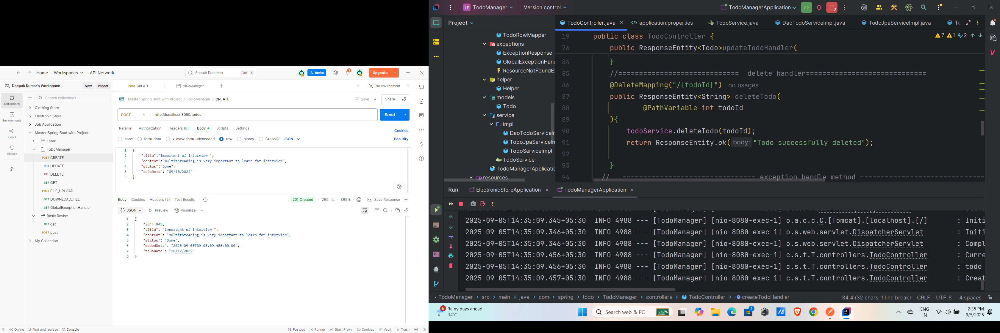
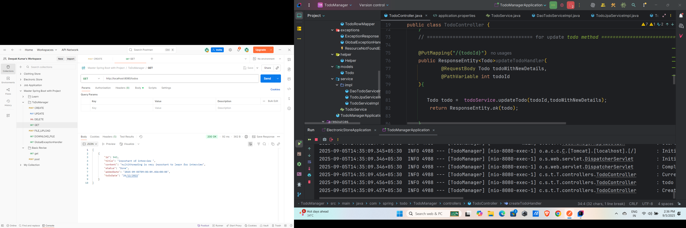
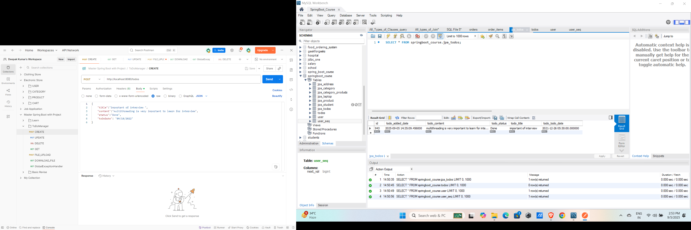
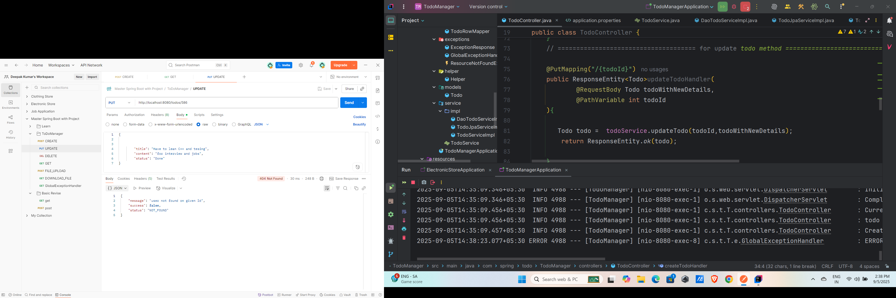
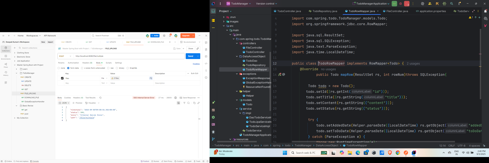

# SpringBoot-Todo-Manager
Spring Boot Todo Application with CRUD operations, JPA,  RESTful APIs, and in-memory database support.

# 📝 Spring Boot Todo Manager

A complete **Todo Management System** built with **Spring Boot**, implementing **CRUD operations, RESTful APIs, File Upload, Image Upload, and Database Integration** using **Spring Data JPA**.  
This project follows a **layered architecture (Controller → Service → Repository)** for clean and maintainable code.

---

## 🚀 Features
- ✅ Create, Read, Update, Delete (CRUD) todos
- 📦 REST API endpoints (GET, POST, PUT, DELETE)
- 💾 Database integration with **Spring Data JPA**
- 🖼️ File & Image upload functionality
- 🔄 Service & Controller layered architecture
- ⚡ Exception handling & validations
- 🌐 RESTful design principles

---

## 📂 Project Structure
TodoManager/

│-- src/main/java/com/spring/todo/TodoManager/

│ │-- controller/ # REST controllers (API endpoints)

│ │-- service/ # Business logic (services)

│ │-- repository/ # Data access layer (JPA repositories)

│ │-- model/ # Entity classes (Todo, User, etc.)

│ └-- TodoManagerApplication.java

│-- src/main/resources/

│ └-- application.properties
│

│-- outputs/ # Screenshots of project

│-- pom.xml

│-- README.md

## ScreenShot(code+postman+mysql)

### Create 

### get

### update

### delete

### upload file

